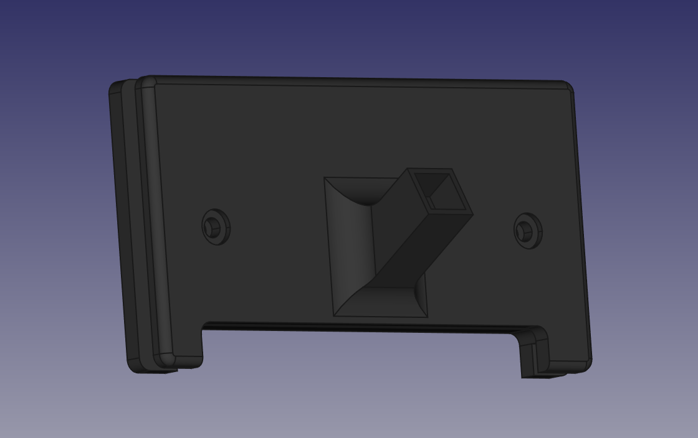

# ffcx-tft35-v3-mount

This is a mounting bracket for the FlashForge Creator X used for the BTT
TFT35 V3.  It is part of an upgrade that includes a BTT SKR Pro 1.1 and
TMC 2209 stepper drivers.

 
This work is licensed under a
<a rel="license" href="http://creativecommons.org/licenses/by-sa/4.0/">
Creative Commons Attribution-ShareAlike 4.0 International License</a>.

## Description

This is a FreeCAD model which contains two parts.  This is designed to
fit into the display hole on the front panel, sandwiching the panel
between the two parts.

This is designed to be used with the
[Slim and Elegant BTT TFT35 V3 Touch Screen](https://www.thingiverse.com/thing:4246505)
on by [3Deddy](https://www.thingiverse.com/3Deddy).

You will need to print all of the items from the project *except for the
two mounting stand-offs*.  There are four other items called standoffs that
support case bottom from the TFT35 PCB.  Those must be printed.

You will need a M3x8mm screw to attach the ball to this mounting bracket.
You will need 2 M3x5mm screws and two M3 nuts to attach the front to the back.
And you will need 4 M3x20mm screws to assemble the TFT35 enclosure.

